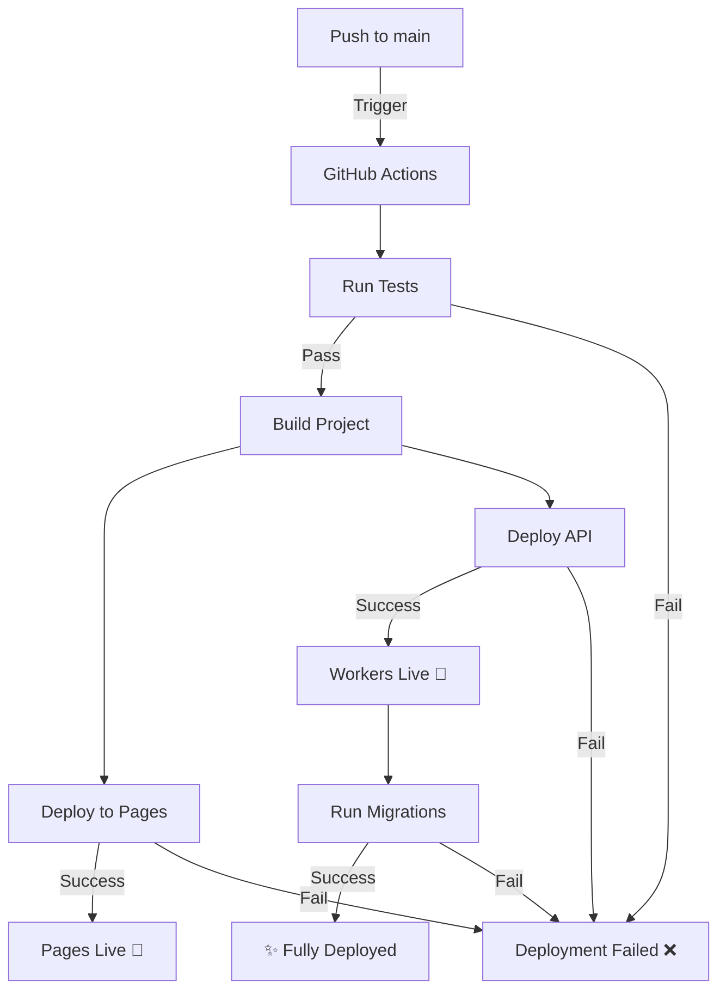

## ⚡ BeatForge Deployment Guide

This document explains the BeatForge deployment architecture and how to deploy to production.

---

### 📦 Deployment Architecture

BeatForge is deployed to **Cloudflare** with two separate components:

| Component | Type | Platform | Trigger |
|-----------|------|----------|---------|
| **Web App** | Next.js 15 | Cloudflare Pages | GitHub Actions |
| **API** | Hono Workers | Cloudflare Workers | GitHub Actions / Manual |
| **Database** | Drizzle ORM | Cloudflare D1 | GitHub Actions |

---

### 🚀 Recommended Deployment (GitHub Actions)

This is the **primary deployment method** and is fully automated:

1. **Push to main branch**
   ```bash
   git add .
   git commit -m "Feature: Add xyz"
   git push origin main
   ```

2. **GitHub Actions automatically:**
   - ✓ Runs tests
   - ✓ Builds the project
   - ✓ Deploys web app to Cloudflare Pages
   - ✓ Deploys API to Cloudflare Workers
   - ✓ Runs database migrations

**Workflow file:** [.github/workflows/deploy.yml](../../.github/workflows/deploy.yml)

---

### 🔧 Required GitHub Secrets

Ensure these secrets are configured in GitHub:

```bash
# Get your account info from: https://dash.cloudflare.com
CLOUDFLARE_API_TOKEN        # Generate at: https://dash.cloudflare.com/profile/api-tokens
CLOUDFLARE_ACCOUNT_ID       # Your Cloudflare Account ID

# Wrangler authentication  
WRANGLER_API_TOKEN          # Same or similar to CLOUDFLARE_API_TOKEN

# Environment
DATABASE_URL                # Cloudflare D1 connection string
STRIPE_SECRET_KEY           # From: https://stripe.dashboard.com
STRIPE_WEBHOOK_SECRET       # From Stripe webhook settings
BETTER_AUTH_SECRET          # Generate: $(openssl rand -base64 32)
```

**Configure secrets:** `bash SETUP_GITHUB_SECRETS.sh` or manually at:
`https://github.com/djmexxico1600/phase1/settings/secrets/actions`

---

### 🛠️ Manual Deployment (Advanced)

If you need to deploy manually, follow these steps:

#### Prerequisites
```bash
# Install dependencies
pnpm install

# Build the project
pnpm run build
```

#### Deploy API Only
```bash
# Deploy Hono API to Cloudflare Workers
pnpm run deploy:api
```

Requires `WRANGLER_API_TOKEN` environment variable:
```bash
export WRANGLER_API_TOKEN="your_token_here"
pnpm run deploy:api
```

#### Deploy Web App Only
```bash
# Build Next.js app
cd apps/web
pnpm run build

# Deploy to Cloudflare Pages
wrangler pages deploy .vercel/output/static \
  --project-name beatforge \
  --branch main
```

Requires `CLOUDFLARE_API_TOKEN` and `CLOUDFLARE_ACCOUNT_ID`:
```bash
export CLOUDFLARE_API_TOKEN="your_token_here"
export CLOUDFLARE_ACCOUNT_ID="your_account_id"
```

---

### 📊 Deployment Status

Check deployment status:

1. **GitHub Actions**: https://github.com/djmexxico1600/phase1/actions
2. **Cloudflare Pages**: https://dash.cloudflare.com/sites/beatforge
3. **Cloudflare Workers**: https://dash.cloudflare.com/workers/overview

---

### 🧪 Pre-Deployment Checks

Before deploying, run:

```bash
# Verify all prerequisites are in place
bash PRE_DEPLOYMENT_CHECK.sh

# Run full test suite
pnpm test:run

# Run e2e tests
pnpm test:e2e
```

---

### 📝 Available Deployment Scripts

From project root:

```bash
# Build everything
pnpm run build

# Build just the API
pnpm run build:api

# Deploy just the API
pnpm run deploy:api

# Run migrations
pnpm run db:migrate:prod

# Type-check everything
pnpm run type-check

# Run tests
pnpm test:run
```

---

### 🔄 Deployment Workflow



---

### 🐛 Troubleshooting

#### Build Fails: "Could not detect static files"
**Cause:** Web app hasn't been built or not in the correct directory.
**Solution:** 
```bash
cd apps/web && pnpm run build
# Check that .vercel/output/static exists
```

#### API Deployment Fails
**Cause:** Missing WRANGLER_API_TOKEN or wrong config.
**Solution:**
```bash
# Set token
export WRANGLER_API_TOKEN="your_token_here"
# Deploy with explicit config
wrangler deploy --config packages/api/wrangler.toml
```

#### Authentication Failed
**Cause:** Invalid Cloudflare tokens or expired credentials.
**Solution:**
1. Generate new tokens at: https://dash.cloudflare.com/profile/api-tokens
2. Update GitHub secrets: `bash SETUP_GITHUB_SECRETS.sh`
3. Redeploy

#### Pages Deployment Stuck
**Cause:** Large build artifacts or timeout issues.
**Solution:**
```bash
# Clear build cache
rm -rf .vercel
rm -rf .next
# Rebuild and redeploy
pnpm run build
```

---

### 📚 Related Documentation

- [Quick Start Guide](QUICK_START.md)
- [Test Scenarios](TEST_SCENARIOS.md)
- [Architecture Guide](beatforge/ARCHITECTURE.md)
- [CI/CD Workflows](.github/workflows/)

---

### 🎯 Deployment Checklist

Before each deployment:

- [ ] Code reviewed and approved
- [ ] All tests passing locally
- [ ] Pre-deployment checks pass
- [ ] GitHub secrets configured
- [ ] No uncommitted changes
- [ ] Changelog updated
- [ ] Database migrations tested

---

**Last Updated:** April 12, 2026  
**Deployment Platform:** Cloudflare (Pages + Workers)  
**CI/CD:** GitHub Actions  
**Status:** ✅ Production-Ready
